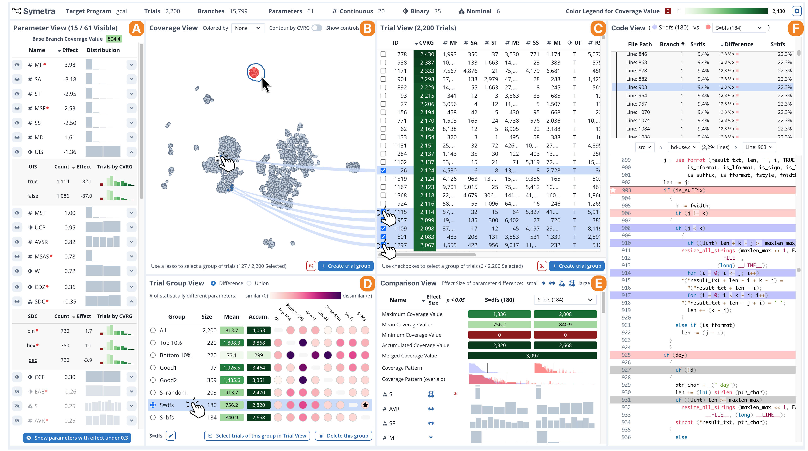
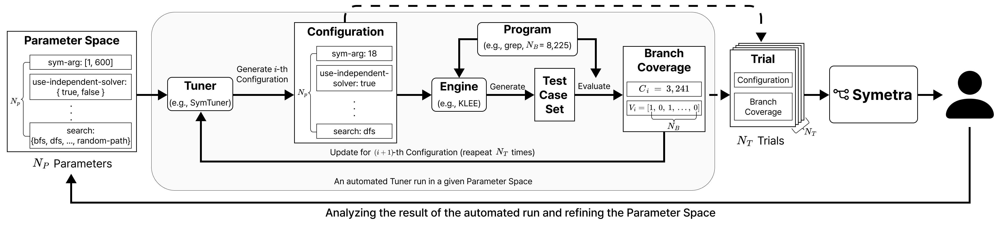

# 🧪 Symetra

[](Symetra__Visual_Analytics_for_the_Parameter_Tuning_Process_of_Symbolic_Execution_Engines.pdf)
[](https://sth49.github.io/Symetra/)
[](LICENSE)
[](https://www.typescriptlang.org)
[](https://react.dev)

**Visual Analytics for the Parameter Tuning Process of Symbolic Execution Engines**

A visual analytics system that supports **Human-in-the-Loop** parameter tuning of symbolic execution engines (e.g., **KLEE**). Symetra helps analysts understand *why* certain configurations work well — not just *which* ones — by revealing how parameters affect **branch coverage** across tuning trials.

> Published at the **Eurographics Conference on Visualization (EuroVis) 2026** · *Computer Graphics Forum*, Vol. 45 (2026), No. 3.



Symetra turns thousands of tuning trials into an interactive workflow: **Overview → Compare Configuration Groups → Inspect Hyperparameters → Trace Branches to Code**.



---

## ✨ Key Features

- **Coverage View**
  - Visualizes branch coverage achieved across trials against the `base` and `total` branch counts.
  - Surfaces which branches are newly covered, hard to reach, or consistently missed.

- **Hyperparameter View**
  - Compares the distribution and impact of each of the **61 KLEE parameters** (boolean / numeric / categorical).
  - Relates parameter values to coverage gains over the baseline.

- **Trial Group View (Collective Analysis)**
  - Contrasts *groups* of configurations to identify differences that affect branch coverage.
  - Helps discover **complementary configurations** whose test cases cover different sets of branches.
  - Area / Bidirectional / Overlapped charts for side-by-side group comparison.

- **Code View**
  - Links a selected branch back to its **source location** (file + line) in the target program.
  - Lets analysts move from a coverage signal to the exact condition responsible for it.

---

## 🎯 Supported Targets

Tuning experiments run KLEE against real C programs, optimizing configuration for branch coverage.

| Target     | Program             | Metric          | Branches (covered / total) |
| :--------- | :------------------ | :-------------- | :------------------------- |
| **grep**   | GNU `grep`          | Branch Coverage | base ≈ 1135 / 8225          |
| **gcal**   | GNU `gcal`          | Branch Coverage | — / —                       |

> Targets are defined in `src/data/targetConfig.json`; trial and branch data live in `src/data/`.

---

## 🔌 Add Your Own Target

1. Add an entry to `src/data/targetConfig.json` (`name`, `base`, `total`, `max`, …).
2. Drop the tuning results as `src/data/tuned_parameters_<name>.json` and branch metadata as `src/data/branch_info_<prefix>.json`.
3. Describe parameters in `src/data/parameter_descriptions.csv`.

The app loads these dynamically — see `src/App.tsx` and `src/model/experiment.ts`.

---

## ⚡ Quick Start

```bash
# 1. Install dependencies
pnpm install

# 2. Launch the dev server (HMR)
pnpm run dev

# 3. Build for production
pnpm run build

# 4. Preview the production build
pnpm run preview
```

> Symetra is a client-side application — the experiment data is bundled from `src/data/`, so no backend server is required.

---

## ⚙️ Configuration

### Deployment base path

The public base path is set in `vite.config.ts`. For the GitHub Pages project site it is `/Symetra/`; for root/custom-domain hosting use `/`.

```ts
// vite.config.ts
export default defineConfig({
  plugins: [react()],
  base: "/Symetra/",
});
```

### Experiment metric

Defined in `src/data/config.json`:

| Field         | Description                          | Example     |
| :------------ | :----------------------------------- | :---------- |
| `metric.name` | Optimization metric                  | `Coverage`  |
| `baseValue`   | Baseline (default-config) coverage   | `1473.37`   |
| `totalBranch` | Total branches in the target program | `8225`      |

---

## 📊 System Overview

```
   src/data/*.json ──▶  Model layer  ──▶  React + visx/D3/Plotly views
   (trials, branch       (Experiment,       • Overview
    info, config)         Hyperparam,       • Coverage View
                          Trial, Target)    • Hyperparameter View
                              │             • Trial Group View
                         Zustand store ────▶ • Code View
```

**Tech stack:** React 18 · TypeScript 5 · Vite 5 (SWC) · Chakra UI · D3 / visx / Plotly.js · Zustand

---

## 🔗 Related Resources

- **KLEE** → [KLEE: Unassisted and Automatic Generation of High-Coverage Tests](https://llvm.org/pubs/2008-12-OSDI-KLEE.html)
- **ATMSeer** → [Increasing Transparency and Controllability in AutoML](https://doi.org/10.1145/3290605.3300911)
- **HyperTendril** → [User-driven Hyperparameter Optimization](https://doi.org/10.1109/TVCG.2020.3030380)

---

## 📚 Citation

If you use Symetra in your research, please cite:

```bibtex
@article{hong2026symetra,
  title     = {Symetra: Visual Analytics for the Parameter Tuning Process of Symbolic Execution Engines},
  author    = {Hong, Donghee and Kim, Minjong and Cha, Sooyoung and Jo, Jaemin},
  journal   = {Computer Graphics Forum},
  volume    = {45},
  number    = {3},
  year      = {2026},
  note      = {Proc. Eurographics Conference on Visualization (EuroVis)},
  publisher = {The Eurographics Association and John Wiley \& Sons Ltd.}
}
```

---

## 👥 Authors

| Name             | Affiliation             | Email                  |
| :--------------- | :---------------------- | :--------------------- |
| **Donghee Hong** | Sungkyunkwan University | dh.hong@skku.edu       |
| **Minjong Kim**  | Sungkyunkwan University | minjong.kim@skku.edu   |
| **Sooyoung Cha** | Sungkyunkwan University | sooyoung.cha@skku.edu  |
| **Jaemin Jo\***  | Sungkyunkwan University | jmjo@skku.edu          |

_\* Corresponding author_

---

## 🙏 Acknowledgments

This work was supported by the Institute of Information & Communications Technology Planning & Evaluation (IITP) grant funded by the Korea government (MSIT):

- **RS-2019-II190421** — Artificial Intelligence Graduate School Program (Sungkyunkwan University)
- **RS-2024-00438686** — Development of software reliability improvement technology through identification of abnormal open sources and automatic application of DevSecOps

and by the National Research Foundation of Korea (NRF) grant funded by the Korea government (**RS-2025-24873100**).

---

## 📄 License

Released under the [MIT License](LICENSE).
